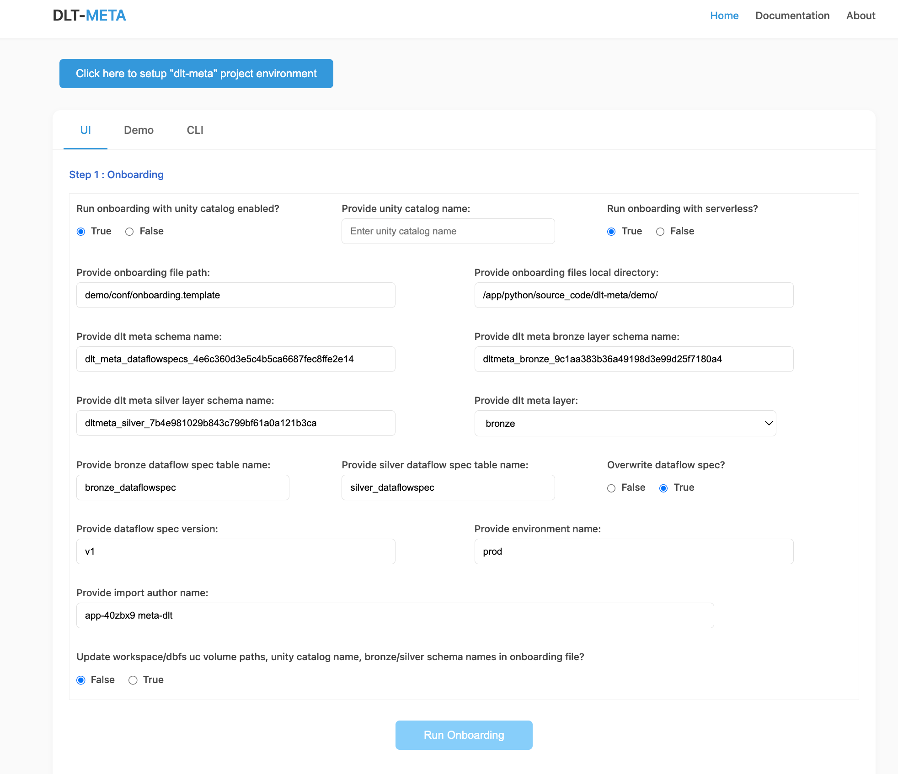
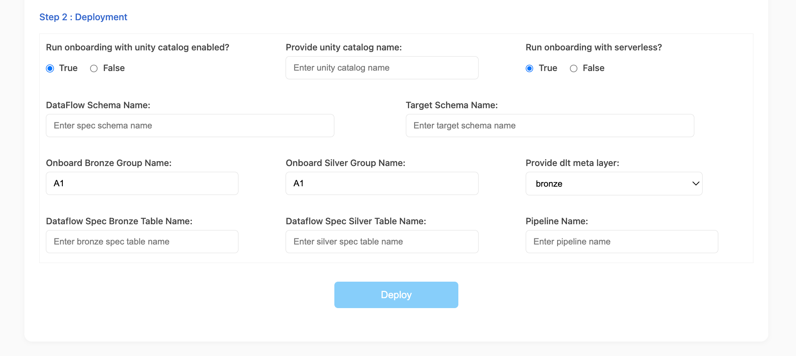
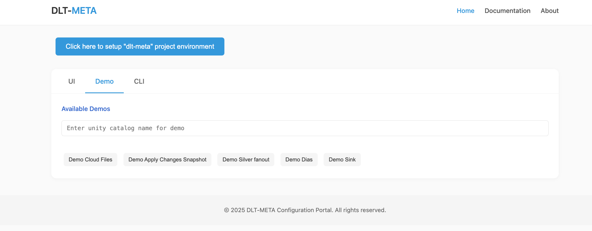

# DLT-META Lakehouse App

## Prerequisites

### System Requirements
- Python 3.8.0 or higher
- [Databricks CLI](https://docs.databricks.com/en/dev-tools/cli/tutorial.html) (latest version, e.g., 0.244.0)
- Configured workspace access

### Initial Setup
1. Authenticate with Databricks:
   ```commandline
   databricks auth login --host WORKSPACE_HOST
   ```

2. Setup Python Environment:
   ```commandline
   git clone https://github.com/databrickslabs/dlt-meta.git
   cd dlt-meta
   python -m venv .venv
   source .venv/bin/activate
   pip install databricks-sdk
   ```

## Deployment Options

### Deploy to Databricks

1. Create Custom App:
   ```commandline
   databricks apps create demo-dltmeta
   ```
   > Note: Wait for command completion (a few minutes)

2. Setup App Code:
   ```commandline
   cd dlt-meta/lakehouse_app
   
   # Replace testapp with your preferred folder name
   databricks sync . /Workspace/Users/<user1.user2>@databricks.com/testapp
   
   # Deploy the app
   databricks apps deploy demo-dltmeta --source-code-path /Workspace/Users/<user1.user2>@databricks.com/testapp
   ```

3. Access the App:
   - Open URL from step 1 log, or
   - Navigate: Databricks Web UI → New → App → Back to App → Search your app name

### Run Locally

1. Setup Environment:
   ```commandline
   cd dlt-meta/lakehouse_app
   pip install -r requirements.txt
   ```

2. Configure Databricks:
   ```commandline
   databricks configure --host <your databricks host url> --token <your token>
   ```

3. Start App:
   ```commandline
   python App.py
   ```
   Access at: http://127.0.0.1:5000

## Using DLT-META App

### App User Setup


The app creates a dedicated user account that:
- Handles onboarding, deployment, and demo execution
- Requires specific permissions for UC catalogs and schemas
- Example username format: "app-40zbx9_demo-dltmeta"

### Getting Started

1. Initial Setup:
   - Launch app in browser
   - Click "Setup dlt-meta project environment"
   - This initializes the environment for onboarding and deployment

2. Pipeline Management:
   - Use "UI" tab to onboard and deploy pipelines
   - Configure pipelines according to your requirements

   **Onboarding Pipeline:**
   
   
   
   *Pipeline onboarding interface for configuring new data pipelines*

   **Deploying Pipeline:**
   
   
   
   *Pipeline deployment interface for managing and deploying pipelines*

3. Demo Access:
   - Available demos can be found under "Demo" tab
   - Run pre-configured demo pipelines to explore features

   
   
   *Demo interface showing available example pipelines*

4. Command Line Interface:
   - Access CLI features under the "CLI" tab
   - Execute commands directly from the web interface

   
   
   *CLI interface for command-line operations*
